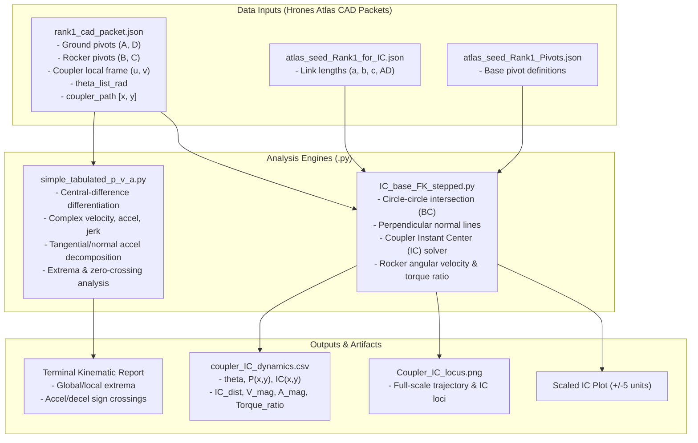
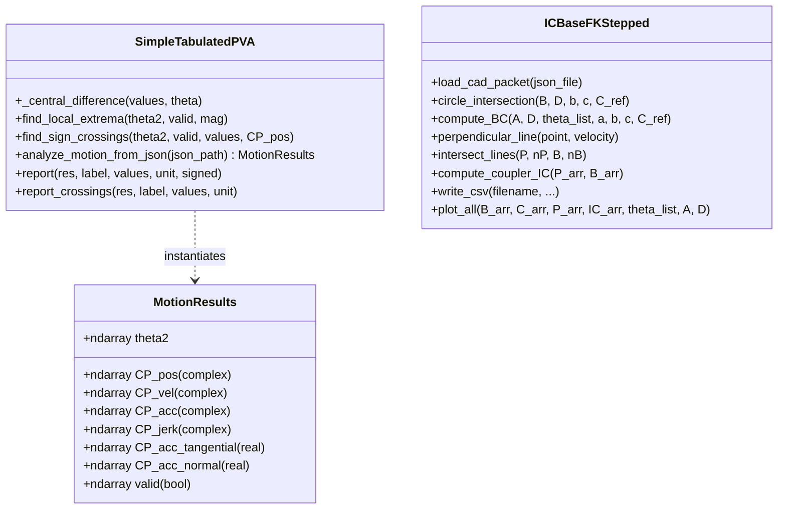
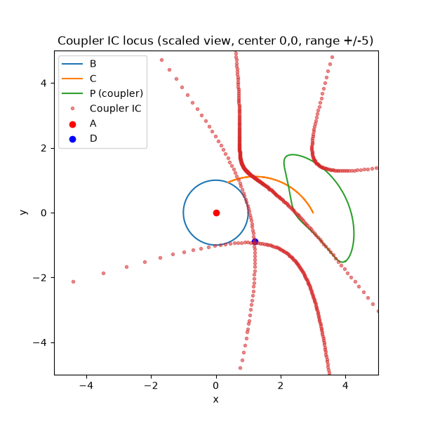

# pos_vel_accel_jerk

Kinematic and dynamic motion analysis engine for four-bar planar linkages. Given seed geometry and coordinate datasets exported from the [Hrones & Nelson Atlas Project](https://github.com/jimsybeldon/Hrones_Altas_With_Theta_As_Output), this package computes coupler point position, velocity, acceleration, jerk, instant centers of rotation (IC), tangential and normal acceleration decomposition, and dynamic torque transmission ratios.

---

## Architecture & Data Flow

### System Data Flow



### Module & Component Architecture



---

## Mathematical Formulation

### 1. Complex-Vector Differentiation
Let coupler point position be represented as a complex trajectory $P(\theta) = x(\theta) + i y(\theta)$. Using central differencing with respect to crank angle $\theta$:

$$\frac{dP}{d\theta} \approx \frac{P(\theta_{k+1}) - P(\theta_{k-1})}{\theta_{k+1} - \theta_{k-1}}$$

Higher derivatives are obtained iteratively:
- **Velocity**: $V(\theta) = \frac{dP}{d\theta}$
- **Acceleration**: $A(\theta) = \frac{dV}{d\theta} = \frac{d^2P}{d\theta^2}$
- **Jerk**: $J(\theta) = \frac{dA}{d\theta} = \frac{d^3P}{d\theta^3}$

### 2. Tangential & Normal Acceleration Decomposition
With scalar speed $v = |V(\theta)|$:
- **Tangential Acceleration** ($a_t = \frac{d|v|}{dt}$):
  $$a_t = \frac{\operatorname{Re}(\overline{V} \cdot A)}{|V|}$$
- **Normal (Centripetal) Acceleration** ($a_n = \frac{v^2}{\rho}$):
  $$a_n = \frac{\operatorname{Im}(\overline{V} \cdot A)}{|V|}$$

### 3. Coupler Instant Center (IC) Calculation
Given velocity vector $V_P$ at coupler point $P$ and $V_B$ at crank pin $B$, the normal lines perpendicular to each velocity vector are solved for their unique intersection $IC$:

$$(x - P) \cdot n_P = 0, \quad (x - B) \cdot n_B = 0 \quad \text{where } n = (-v_y, v_x)$$

$$\begin{bmatrix} n_{P,x} & n_{P,y} \\ n_{B,x} & n_{B,y} \end{bmatrix} \begin{bmatrix} IC_x \\ IC_y \end{bmatrix} = \begin{bmatrix} n_P \cdot P \\ n_B \cdot B \end{bmatrix}$$



### 4. Rocker Velocity & Ideal Torque Transmission Ratio
From rocker angular position $\theta_c = \operatorname{atan2}(C_y - D_y, C_x - D_x)$:

$$\omega_{rocker} = \frac{d\theta_c}{d\theta_{in}}, \quad \text{Torque Ratio } \tau_{ratio} = \frac{\omega_{in}}{\omega_{rocker}}$$

---

## File & Module Catalog

| File | Type | Description |
| :--- | :--- | :--- |
| [simple_tabulated_p_v_a.py](simple_tabulated_p_v_a.py) | Python Script | Forward kinematics evaluation of tabulated CAD paths; computes velocity, acceleration, jerk, extrema, and accel/decel sign transitions. |
| [IC_base_FK_stepped.py](IC_base_FK_stepped.py) | Python Script | Four-bar closure solver using circle intersections, instant center locus tracing, rocker kinematics, and CSV/plot generation. |
| [main.py](main.py) | Python Script | Workspace starter entrypoint. |
| [rank1_cad_packet.json](rank1_cad_packet.json) | Data Input | Geometric definitions (pivots $A, B, C, D$, coupler frame $u, v$), discrete crank sweep angles $\theta$, and coupler curve points. |
| [atlas_seed_Rank1_for_IC.json](atlas_seed_Rank1_for_IC.json) | Data Input | Link lengths ($a, b, c, AD$) for the rank 1 four-bar linkage seed. |
| [atlas_seed_Rank1_Pivots.json](atlas_seed_Rank1_Pivots.json) | Data Input | Pivot coordinate configuration for rank 1 four-bar linkage seed. |
| [coupler_IC_dynamics.csv](coupler_IC_dynamics.csv) | Data Output | Tabular results containing $\theta$, $P(x,y)$, $IC(x,y)$, $IC_{distance}$, velocities, accelerations, and torque ratios. |
| [Coupler_IC_locus.png](Coupler_IC_locus.png) | Image Artifact | Generated plot displaying pivot paths ($B, C$), coupler curve ($P$), and coupler instant center locus ($IC$). |
| [img.png](img.png) | Image | Hrones Atlas seed search and ranking visualization. |
| [img_1.png](img_1.png) | Image | Instant center trajectory and curvature reference. |
| [img_2.png](img_2.png) | Image | Linkage geometry and reference coordinate frames. |
| [ToDo.md](ToDo.md) | Documentation | Development task list and seed conversion notes. |
| [markdowns/dataclass_explanation.md](markdowns/dataclass_explanation.md) | Documentation | References and explanations for Python `@dataclass` usage in motion results. |

---

## Getting Started

### Prerequisites

- Python 3.9+
- NumPy
- Matplotlib

Install required dependencies:

```powershell
pip install numpy matplotlib
```

### Running Kinematic Motion Analysis

To compute velocity, acceleration, jerk, extrema, and zero-crossing transitions from the CAD packet:

```powershell
python simple_tabulated_p_v_a.py
```

### Running Instant Center & Dynamic Torque Analysis

To solve four-bar closure, calculate instant centers, export [coupler_IC_dynamics.csv](coupler_IC_dynamics.csv), and render trajectory plots:

```powershell
python IC_base_FK_stepped.py
```
