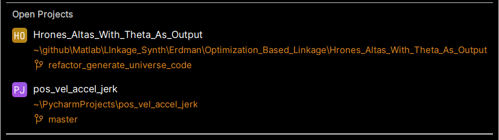

# simple_tabulated_p_v_a.py 

uses json data to find position, velocity, acceleration, and jerk for the coupler point of the linkaae in the json data

# IC_base_FK_stepped.py

See the 

Lots as linkage potential if you can follow the math.

The hrones git repo is where the data was generated and is the seed vetting engine.  this repo is analytical support
and should be folded into the Hrones repo if meritted.

https://github.com/jimsybeldon/Hrones_Altas_With_Theta_As_Output