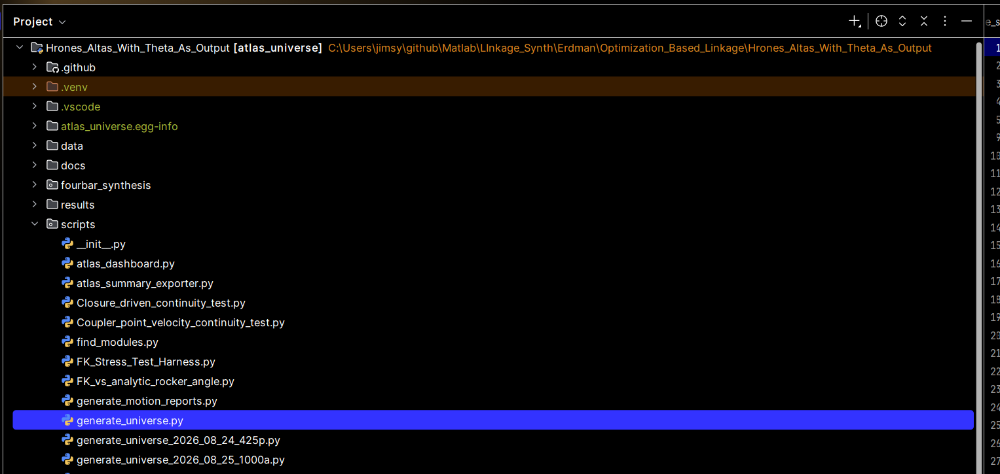

# This uses data generated from this search project:

##  1.) ~~from fourbar_cp_kinematics.py~~         *2026 09 02*

        update comments that were stripped into fourbar_cp_kinematics_v2.py
        they are useful

~~up to line 280 on v2 so far-  line 276 of v0~~

## 2.) this whole thing is useful for the data from my atlas_seeds_29_only.json data:

        [
          { "name": "Seed-29", "a": 1.0, "b": 2.5, "c": 2.5, "AD": 1.5 }
        ]

and

for the Seed-29_rank1_cad_packet.json file the states:

{
  "ground_pivots": {
    "A": [
      0.0,
      0.0
    ],
    "D": [
      1.1785714285714286,
      -0.9278843611976128
    ]
  },
  "rocker_pivots": {
    "B": [
      1.0,
      0.0
    ],
    "C": [
      3.5,
      0.0
    ]
  },
  "coupler_local_frame": {
    "u": 2.5,
    "v": -2.0
  },
  "theta_list_rad": [
    0.0,
    0.008738783459220564,
    0.01747756691844113,
    0.026216350377661693,
    0.03495513383688226,
    0.04369391729610282,
    0.052432700755323386,
    0.06117148421454395,
    0.06991026767376451,
    0.07864905113298508,
    0.08738783459220564,
    0.09612661805142621,
    0.10486540151064677,
    0.11360418496986734,

...

  "coupler_path": [
    [
      3.5,
      -1.9999999999999998
    ],
    [
      3.493062127851931,
      -1.9998555726048428
    ],

...

**  "precision_overlay": {
    "precision_points": [
      [
        4.0,
        -1.5
      ],
      [
        2.0,
        -0.00375
      ]
    ],
    "theta_star": [
      5.88120126805544,
      3.1372232618601825
    ],
    "coupler_at_theta": [
      [
        3.9325911725462426,
        -1.4756899799780296
      ],
      [
        2.201565033893314,
        -0.00214648830095307
      ]
    ]
  }
}**